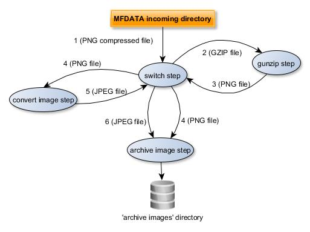
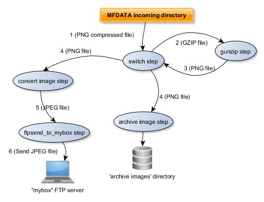

# Additional Tutorials

## A PNG to JPEG conversion plugin

Let's create an plugin to convert a PNG image to a JPEG image and then to archive the JPEG image.

First, we have to modify the `archive_image` plugin to be able to archive all images and not only PNG images.

Open the `config.ini` file of the `archive_image` plugin and change the `switch_logical_condition` to accept all images:

```cfg
switch_logical_condition = ( b'image' in ['latest.switch.main.system_magic'] )
```

Now, **create the converter plugin** from the MFDATA `fork` template which allows to **execute shell commands in a subprocess**. Enter the command:
```bash
bootstrap_plugin.py create --template=fork convert_png
```

Configure the `switch_logical_condition` parameter in  the `convert_png/config.ini` that allow to convert PNG files.

```cfg
switch_logical_condition = ( x['latest.switch.main.system_magic'].startswith(b'PNG image') )
```

Then, let's create a script file (`convert.sh` in the `convert_png` plugin directory) to convert a PNG file to a JPEG file (we will use the ImageMagick convert tool):
```bash
#!/bin/bash
# $1 is the incoming PNG file.

# Convert to JPEG
convert "$1" "$1.jpeg"
# Re-inject the converted file to the switch plugin
inject_file --plugin=switch "$1.jpeg"
```

Set `convert.sh` as an executable file:
```bash
chmod +x convert.sh

```

Now, we have to say to the `convert_png` plugin to launch the `convert.sh` script for each file. To do this, configure the `arg_command-template` parameter in the `convert_png/config.ini`:

```cfg
arg_command-template = {PLUGIN_DIR}/convert.sh {PATH}
```

**Caution**: the `arg_command-template` command must NOT be enclosed by quotation marks:
```cfg
INVALID:
arg_command-template = "{PLUGIN_DIR}/convert.sh {PATH}"
arg_command-template = '{PLUGIN_DIR}/convert.sh {PATH}'

VALID
arg_command-template = {PLUGIN_DIR}/convert.sh {PATH}
```

Then, install (as dev build) the plugin by entering the command `make develop` from the `convert_png` plugin directory.

Check the plugin is installed, by running `plugins.list`.

Run the plugin: inject a PNG compressed file :

```bash
inject_file --incomming /tmp/my_png_file.png.gz
```


Check the archive directory. Go to the `/tmp/my_archive_image/[YYYYMMDD]` directory where `[YYYYMMDD]` is the current date.You will see two files, a PNG one and a JPEG one, with a 'RANDOM_ID' name: e.g. `85c87fe07e604c01bb81ba8311611466` and  `c210be74b8644aeeb6c1d41e4883649d`:

```bash
file 85c87fe07e604c01bb81ba8311611466
```

> 85c87fe07e604c01bb81ba8311611466: PNG image data, 120 x 165, 8-bit/color RGBA, non-interlaced

```bash
file c210be74b8644aeeb6c1d41e4883649d
```

> c210be74b8644aeeb6c1d41e4883649d: JPEG image data, JFIF standard 1.01  

The diagram below shows the data flow:




1. The GZIP file is processed by the `switch` plugin from the MFDATA `incoming` directory
2. The `gunzip` plugin uncompresses the file
3. The `gunzip` plugin puts the PNG file in the `incoming` directory. It will be processed by the `switch` plugin
4. The `archive_image` plugin processes the PNG file (its `switch_logical_condition` is `True`). The `convert_image` plugin processes the PNG file (its `switch_logical_condition` is `True`).
5. The `convert_image` plugin puts (injects) the JPEG file in the `incoming` directory throw the `switch` plugin (`inject_file --plugin=switch "$1.jpeg"` command in the `convert.sh` script). It will be processed by the `switch` plugin.
6. The `archive_image` plugin processes the JPEG file (its `switch_logical_condition` is `True`).


## Sending a file by FTP

Let's now create an plugin from the `ftpsend` MFDATA template.

This new plugin aims to send a JPEG file to a FTP host.

Use the `ftpsend` template to create the plugin : run the following command:
```bash
bootstrap_plugin.py create --template=ftpsend ftpsend_to_mybox
```

Enter the `machine`, `user` and `passwd` when prompting, respectively  the destination host, user and password (press [Enter] for the other parameters to keep the default value).


Go to the `ftpsend_to_mybox` sub-directory, open the `config.ini` file and check, in the `[step_send]` section, the parameters you have just entered:
```cfg
# machine : target machine for ftp transfer
arg_machine = mybox
# user : target user for ftp transfer
arg_user = myuser
# passwd : target passwd for ftp transfer
arg_passwd = mypassword
```

Then, install (as dev build) the plugin by entering the command `make develop` from the `ftpsend_to_mybox` plugin directory.

Check the plugin is installed, by running `plugins.list`.

Let's now change the `convert_png` plugin to feed the new `ftpsend_to_mybox` plugin.

Open the `convert_png/convert.sh` script file and change the `inject_file` command as below in the `convert_png` plugin directory) to convert a PNG file to a JPEG file (we will use the ImageMagick convert tool):
```bash
#!/bin/bash
# $1 is the incoming PNG file.

# Convert to JPEG
convert "$1" "$1.jpeg"
# Re-inject the converted file to the switch plugin
inject_file --plugin=ftpsend_to_mybox --step=send "$1.jpeg"
```

Notice the `ftpsend` template contains two steps (`send`and `reinject`). It has no `main` (default) step. That's why we specify the step to execute in the `inject_file` command.

The diagram below shows the data flow:




1. The GZIP file is processed by the `switch` plugin from the MFDATA `incoming` directory
2. The `gunzip` plugin uncompress the file
3. The `gunzip` plugin puts the PNG file in the `incoming` directory. It will be processed by the `switch` plugin
4. The `archive_image` plugin processes the PNG file (its `switch_logical_condition` is `True`). The `convert_image` plugin processes the PNG file (its `switch_logical_condition` is `True`).
5. The `convert_image` plugin puts (injects) the JPEG file to the `ftpsend_to_mybox` plugin (`inject_file --plugin=ftpsend_to_mybox --step=send  "$1.jpeg""` command in the `convert.sh` script). It will be processed by the `ftpsend_to_mybox` plugin.
6. The `ftpsend_to_mybox` plugin sends the JPEG file to "mybox".

## Using the `batch` template

TODO

## Create a plugin from scratch

This tutorial is designed to help you get started with MFDATA plugin from scratch, i.e. without any MFDATA template.

Let's suppose we want to create a plugin to convert a GRIB file into a NetCDF file.

In this tutorial:

- we will use:
	- the `grib_to_netcdf` command from eccodes (see https://confluence.ecmwf.int/display/ECC) and available in the Metwork MFEXT 'scientific' package
	- the `NetCDF4` Python library (see http://unidata.github.io/netcdf4-python/)
- we will call `grib_to_netcdf` command from Python code (instead of a shell script).
- we will save the NetCDF file in a specific directory
- we will save the "tags attributes" set by the switch plugin to a "tags" file in the same directory as the NetCDF file one
- we will read some data of the NetCDF file from Python code with the `NetCDF4` Python library

**Important**: 
- if you are behind a proxy, you have to set `http_proxy` and `https_proxy` environment varaibles in order to be able to download any Python package you may need.
- you may also need to disable your Linux firewall:

    ```bash
    systemctl status firewalld
    systemctl stop firewalld.service
    systemctl disable firewalld

    ```

### Create the plugin

In order to create the plugin : run the following command:
```bash
bootstrap_plugin.py create convert_grib2
```

By default, a `main.py` Python script is created in the `convert_grib2` directory. It corresponds to the `main` step of the plugin:

```python
#!/usr/bin/env python3

from acquisition.step import AcquisitionStep


class Convert_grib2MainStep(AcquisitionStep):

    plugin_name = "convert_grib2"
    step_name = "main"

    def process(self, xaf):
        self.info("process for file %s" % xaf.filepath)
        return True


if __name__ == "__main__":
    x = Convert_grib2MainStep()
    x.run()


```

It contains a derived class `Convert_grib2MainStep` that inherits of the `AcquisitionStep` class.


The most important method is `process` which overrides the `process` method of the base class `AcquisitionStep`.

The `process` method is called in the  `run` method of the `AcquisitionStep` class.

The `xaf` parameter (from `XattrFile` class) is the file to be processed.

### Set dependencies

To build the plugin, we needs the `eccodes` programs and libraries (see https://confluence.ecmwf.int/display/ECC) provided in the MFEXT 'scientific' package.

So, the MFEXT 'scientific' package must be installed. To check this, from the `/home/mfdata/` directory, just enter the `grib_to_netcdf` command:
```bash
grib_to_netcdf --help
```

For further about `grib_to_netcdf`, see https://confluence.ecmwf.int/pages/viewpage.action?pageId=23693254

Tell the plugin to use MFEXT 'scientific' package. Edit the `.layer2_dependencies` in the `convert_grib2` directory and add the `python3_scientific@mfext` at the end:
```cfg
python3@mfdata
python3_scientific@mfext
```

As we will use the `NetCDF4` Python library, we have to add this dependency to the 'Requirements' file (for more details on this topic, see https://pip.readthedocs.io/en/1.1/requirements.html). Edit the `python3_virtualenv_sources/requirements-to-freeze.txt` file and add the following line:
```cfg
NetCDF4
```
If you don't mention any version of the library, the lastest available library will be use.

You may mention a specific version, you will use:
```cfg
NetCDF4==1.4.2
```

Check the dependencies settings by entering the command `make develop` from the `convert_grib2` plugin directory.

### Fill in the plugin


Let's now add Python code into the plugin to convert input GRIB file to NetCDF.


**Create a** `grib_to_netcdf_command` **Python method** which builds and runs the ecCodes `grib_to_netcdf` command:

```python
#!/usr/bin/env python3
import re
import subprocess
....

class Convert_grib2MainStep(AcquisitionStep):
...

    def grib_to_netcdf_command(self, grib_file_path, netcdf_file_path):
        """
        Convert GRIB file to Netcdf File
        :param grib_file_path: GRIB file path to convert
        :param netcdf_file_path: output NetCDF file path to convert
        :raise: Exception if something wrong happens
        """

        # Build the 'grib_to_netcdf' command
        command_grib_to_netcdf = list()
        command_grib_to_netcdf.append("grib_to_netcdf")
        command_grib_to_netcdf.append(grib_file_path)
        command_grib_to_netcdf.extend("-k 3 -d 0 -D NC_FLOAT".split(' '))
        command_grib_to_netcdf.append("-o")
        command_grib_to_netcdf.append(netcdf_file_path)

        self.debug(command_grib_to_netcdf)

        try:
            # Run the the 'grib_to_netcdf' command
            result_grib_to_netcdf = subprocess.check_call(command_grib_to_netcdf)

            if result_grib_to_netcdf != 0:
                msg = 'Unable to execute command {}. Result is: {}.'.format(command_grib_to_netcdf,
                                                                             result_grib_to_netcdf)

                raise Exception(msg)

        except subprocess.CalledProcessError as e:
            msg = 'Unable to execute command {}. Reason: {}'.format(command_grib_to_netcdf, str(e))
            raise Exception( msg, e)


```

_ _ _

Now, we need to **set the destination directory** where the NetCDF files will be stored. In order to to this, we add an argument (parameter) in the section `[step_main]` of our `config/config.ini` plugin file:
```cfg
[step_main]
....
# Destination directory of the converted NetCDF files
arg_netcdf-dest-dir = /tmp/my_netcdf
....
```

Notice:

- the parameter must always be prefixed by `arg_`. Then, use '-' and not '_' in your parameter: `arg_netcdf-dest-dir` is valid, but arg_netcdf_dest_dir is NOT valid.
- the argument parameter as Python variable will be `self.args.netcdf_dest_dir`.


Then, we must override the `add_extra_arguments` method in order to parse our `netcdf_dest-dir` argument:

```python
class Convert_grib2MainStep(AcquisitionStep):

...

    def add_extra_arguments(self, parser):
        # Call the parent add_extra_arguments
        super().add_extra_arguments(parser)

        parser.add_argument('--netcdf-dest-dir', action='store',
                            default=None,
                            help='Netcdf destination directory')
...
```

We have to check `netcdf-dest-dir` argument is set and create the destination directory. We do this in the `init` method:
```python

...
from mfutil import mkdir_p_or_die
...

class Convert_grib2MainStep(AcquisitionStep):
...
    def init(self):
    	super().init()

        if self.args.netcdf_dest_dir is None:
            raise Exception('you have to set a netcdf-dest-dir')

        # Create dthe destination directory
        mkdir_p_or_die(self.args.dest_dir)

...
```
- - -

**We are only interested in GRIB file.** 

By default, the Linux `magic` file doesn't contain any GRIB file identification.

So, we need to create a `magic` file in the root directory of the `convert_grib2` plugin (for further about `magic`, see :doc:`Identify particular types of files <../mfdata_and_magic>`.


**Create a new** `magic` **file** in your plugin directory and add `grib` identification rules:
```cfg
# GRIB
0   string  GRIB    GRIB file
```

**CAUTION**: the `magic` file must be named `magic` and must be stored in the plugin root directory (i.e., here, `convert_grib2` directory).

Then, **set the** `switch_logical_condition` to accept only GRIB file:

```cfg
switch_logical_condition = (x['latest.switch.main.convert_grib2_magic'].startswith(b'GRIB file'))
```

**CAUTION**: Because we create a custom `magic` file, the condition must be set on `latest.switch.main.convert_grib2_magic` instead of `latest.switch.main.system_magic`:

```cfg
# CORRECT
switch_logical_condition = (x['latest.switch.main.convert_grib2_magic'].startswith(b'GRIB file'))
```

```cfg
# BAD
switch_logical_condition = (x['latest.switch.main.system_magic'].startswith(b'GRIB file'))
```
_ _ _

**Fill in the** `process` **method**:

```python

...
import os
...

 
   def process(self, xaf):
        """
        This function:
        - Convert a GRIB file into a NetCDF file.
        - Read some data of the NetCDF file

        :param xaf: the input GRIB data file as an XattrFile object
        :return: True, if the process is successful, False, if the process failed
        """
 
        # xaf.filepath is the internal file name created by the switch plugin into a temporary directory
        self.info("process for file %s" % xaf.filepath)

        try:
            # In order to get the original GRIB file name, call AcquisitionStep.get_original_basename
            original_grib_filename = str(AcquisitionStep.get_original_basename(self, xaf))

            # Build the output NetCDF file name from the input file name,
            netcdf_filename = re.sub(r'(\.grb|\.grib2|\.grib)$', '', str(original_grib_filename)) + ".nc"
            netcdf_filepath = os.path.normpath(os.path.join(self.args.netcdf_dest_dir, netcdf_filename))

            # Convert Grib to Netcdf
            self.grib_to_netcdf_command(xaf.filepath, netcdf_filepath)

        except Exception as e:
            self.exception(str(e))
            return False

        return True

```

Then, **install (as dev build) the plugin** by entering the command `make develop` from the `convert_grib2` plugin directory.

Check the plugin is installed, by running `plugins.list`.

**Run the plugin**: inject a GRIB file :

```bash
inject_file --incomming /tmp/my_grib_file.grib2
```

Check the NetCDF file have been created and stored in the `netcdf-dest-dir` directory. You mays check the content of the NetCDF file through th `ncdump` commands (available in MFEXT package):

```bash
ncdump -h /tmp/my_netcdf/my_grib_file.nc
```

You mays also check the logs in the `step_convert_grib2_main.stdout` and `step_convert_grib2_main.stderr` in the `/home/mfdata/log` directory.

_ _ _

**Did the conversion fail ?** *Possible reasons are due to some resource limits configured in `config/config.ini` file of the plugin. In order to fix these issues, you have to increase the resouce limits, especially the* `rlimit_as` *and/or* `rlimit_fsize` *parameter:*

```cfg
...
# resource limit for each step process
# rlimit_as => maximum area (in bytes) of address space which may be taken by the process.
# rlimit_nofile => maximum number of open file descriptors for the current process.
# rlimit_stack => maximum size (in bytes) of the call stack for the current process.
#     This only affects the stack of the main thread in a multi-threaded process.
# rlimit_core => maximum size (in bytes) of a core file that the current process can create.
# rlimit_fsize =>  maximum size of a file which the process may create.
# (empty value means no limit)
#
rlimit_as = 10000000000
rlimit_nofile = 1000
rlimit_stack = 10000000
rlimit_core = 10000000000
rlimit_fsize = 10000000000
```

*After editing the* `config.ini` *file, just rebuild the plugin with the* `make develop` *command.*

_ _ _

Now, we add some code to **store tags/attributes in an additional file**.

Edit the `convert_grib2/config.ini`and add the following configuration:

```cfg
# Keep tags/attributes in an additional file
arg_keep_tags = True

# If keep_tags=1, the suffix to add to the filename to store tags
arg_keep_tags_suffix = .tags

```

Edit the `main.py` Python script and add some code in `add_extra_arguments` and `process` methods so that it to look like this:

```python
...
from xattrfile import XattrFile
...

    def add_extra_arguments(self, parser):
        # Call the parent add_extra_arguments
        super().add_extra_arguments(parser)

        parser.add_argument('--netcdf-dest-dir', action='store',
                            default=None,
                            help='Netcdf destination directory')
        parser.add_argument('--keep-tags', action='store',
                            type=bool, default=True,
                            help='keep tags/attributes into another file ?')
        parser.add_argument('--keep-tags-suffix', action='store',
                            default=".tags",
                            help='if keep-tags=True, suffix to add to the '
                                 'filename to keep tags')
...

   def process(self, xaf):
        """
        This function:
        - Convert a GRIB file into a NetCDF file.
        - Read some data of the NetCDF file

        :param xaf: the input GRIB data file as an XattrFile object
        :return: True, if the process is successful, False, if the process failed
        """

        # xaf.filepath is the internal file name created by the switch plugin into a temporary directory
        self.info("process for file %s" % xaf.filepath)

        try:
            # In order to get the original GRIB file name, call AcquisitionStep.get_original_basename
            original_grib_filename = str(AcquisitionStep.get_original_basename(self, xaf))

            # Build the output NetCDF file name from the input file name,
            netcdf_filename = re.sub(r'(\.grb|\.grib2|\.grib)$', '', str(original_grib_filename)) + ".nc"
            netcdf_filepath = os.path.normpath(os.path.join(self.args.netcdf_dest_dir, netcdf_filename))

            # Convert Grib to Netcdf
            self.grib_to_netcdf_command(xaf.filepath, netcdf_filepath)

            # We tags/attributes in a specific file
            if self.args.keep_tags:
                tags_filepath = netcdf_filepath + self.args.keep_tags_suffix
                xaf.write_tags_in_a_file(tags_filepath)

            XattrFile(netcdf_filepath).clear_tags()

        except Exception as e:
            self.exception(str(e))
            return False

        return True

```

Build the plugin (`make develop`) and inject your GRIB file again.

Check a `.tags` file has been created next to the NetCDF file in the `netcdf-dest-dir` directory. The content of the `.tags` file looks like:

>0.switch.main.convert_grib2_magic = GRIB file  
0.switch.main.enter_step = 2019-03-20T11:30:41:946203  
0.switch.main.exit_step = 2019-03-20T11:30:42:006251  
0.switch.main.process_status = ok  
0.switch.main.system_magic = data  
1.convert_grib2.main.enter_step = 2019-03-20T11:30:42:018932  
first.core.original_basename = AROME_SP1_201812030600.grib2  
first.core.original_dirname = incoming  
first.core.original_uid = 463d0dc5826a4143a427d0b6b1e3245f  
latest.core.step_counter = 1  
latest.switch.main.convert_grib2_magic = GRIB file  
latest.switch.main.system_magic = data  


_ _ _

**Now, we are going to learn another way to configure a plugin.**

We are going to improve our plugin to be able to customize the configuration of the `grib_to_netcdf` command. As we saw previously, the `grib_to_netcdf` command has optional parameter, we hard-coded (i.e `"-k 3 -d 0 -D NC_FLOAT"`).

We could set an `arg_grib-to-netcdf-options` parameter in  the `convert_grib2/config.ini`, but here, we set this parameter in the MFDATA configuration file `/home/mfdata/config.ini`. This configuration file can contain a section per plugin. The secton name must be named `[plugin_{plugin_name}]`. Edit `/home/mfdata/config.ini` and add the following section and parameter at the ne of the file:
```cfg
[plugin_convert_grib2]
grib_to_netcdf_options=-k 3 -d 0 -D NC_FLOAT

```
Each parameter will be will transform into an environment variable whose pattern is syled like this.

In order to get the new value, you have to:
- either close/reopen your terminal to force a new profile loading or 
- or restart services by entering `service metwork restartmf data` (as `root` user).

For more details, see :doc:`../configure_a_metwork_package`.

:download:`Full convert_grib2 Python example </_downloads/convert_grib2/main.py>`.


