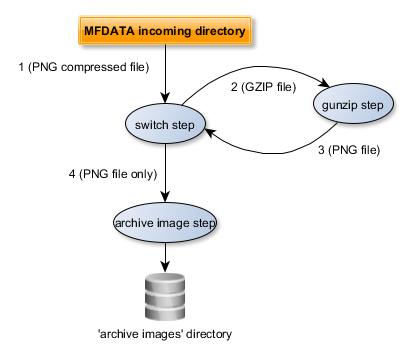

# More examples

## Use of the `ungzip` plugin

The `ungzip` plugin allows you to unzip `.gz` files. This plugin automatically handles `.gz` files and returns the unzipped file to the switch. 

The `ungzip` is **NOT** installed by default.


**First, let's create an `archive_image` plugin from the MFDATA template `archive`.** This template allows you to **archive data**, i.e. moving a file to an associated archiving directory.

Enter the command:
```bash
bootstrap_plugin.py create --template=archive archive_image
```

Configure the `switch_logical_condition` parameter in  the `archive_image/config.ini` that allow to archive only PNG files.

```cfg
switch_logical_condition = ( x['latest.switch.main.system_magic'].startswith(b'PNG image') )
```

Configure the archive directory `arg_dest-dir` parameter in the `archive_image/config.ini` set the `arg_dest-dir` parameter :

```cfg
arg_dest-dir = /tmp/my_archive_image
```

Install (as dev build) the plugin by entering the command from the `archive_image` plugin directory:

```bash
make develop
```

Check the plugin is installed, by running `plugins.list`


Run the plugin: inject a PNG file :

```bash
inject_file --incomming /tmp/my_png_file.png
```


Check the PNG file is 'archived'. Go to the `/tmp/my_archive_image/[YYYYMMDD]` directory where `[YYYYMMDD]` is the current date: you will see your PNG file is archived with a 'RANDOM_ID' name: e.g. `2b199aac9ce2489b9f81f5a274ce7bf0`


Notice, you may change the archive file name, by changing the defaut value of the arg_strftime-template in the `archive_image/config.ini`, e.g.:

```cfg
# strftime-template : template inside above archive directory (strftime
#    placeholders are allowed, / are allowed to define subdirectories,
#    {ORIGINAL_BASENAME}, {ORIGINAL_UID}, {ORIGINAL_DIRNAME}, {RANDOM_ID},
#    {STEP_COUNTER} and {STEP_COUNTER_MINUS_1} are also available
#    Default is : "%Y%m%d/{RANDOM_ID}"
arg_strftime-template = %Y%m%d/{ORIGINAL_BASENAME}_{RANDOM_ID}
```


Now we would also like to archive the compressed PNG images.

**Let's now inject a compressed PNG file (.gz).**

Compress your PNG file (`my_png_file.png.gz`) and inject it:

```bash
inject_file --incomming /tmp/my_png_file.png.gz
```

If the `ungzip` plugin is not installed, you will see the image is not archived in the `/tmp/my_archive_image` directory, because it's not a PNG file but a GZIP file.


**Let's now Install the** `ungzip` **plugin (if not already installed).**

In order to install this plugin, enter the command:

```bash
plugins.install /opt/metwork-mfdata/share/plugins/ungzip-[[version]-1.metwork.mfdata.plugin

```

where `[version]` is the value of the `version` of the `ungzip` plugin, e.g.  plugins.install /opt/metwork-mfdata/share/plugins/ungzip-master.ci53.508288c-1.metwork.mfdata.plugin

Then, check the `ugzip` plugin is installed, enter:

```bash
plugins.list
```

You should show the `ungzip` plugin is installed

    | NAME                      | VERSION                   | RELEASE
    ---------------------------------------------------------------------------
    | switch                    | master.ci77.f0d7991       | 1
    | ungzip                    | master.ci53.508288c       | 1
	| archive_image             | 1.0.0                     | 1


**Now, inject again the compressed PNG file.**

You will see the PNG file is now archived in the `/tmp/my_archive_image`, according to the  `arg_strftime-template` parameter, as an uncompressed PNG file.

The diagram below shows the data flow:



1. The GZIP file is process by the `switch` plugin from the MFDATA `incoming` directory
2. The `gunzip` plugin uncompress the file and put the uncompressed PNG file in the `incoming` directory
3. The `archive_image` plugin process the PNG file (the `switch_logical_condition` is `True`)


Note : the `archive` template allows to keep tags/attributes, about the data flow, into another file. The `.tags` file is stored in the same directory as the archived file directory (same filename with extension `.tag`):

> 0.switch.main.enter_step = 2019-03-12T06:39:49:234958  
0.switch.main.exit_step = 2019-03-12T06:39:49:238562   
0.switch.main.process_status = ok   
0.switch.main.system_magic = gzip compressed data, was "temp.png", from Unix, last modified: Mon Mar 11 14:21:31 2019    
1.ungzip.main.enter_step = 2019-03-12T06:39:49:244102   
1.ungzip.main.exit_step = 2019-03-12T06:39:49:244923   
1.ungzip.main.process_status = ok   
2.switch.main.enter_step = 2019-03-12T06:39:49:250833   
2.switch.main.exit_step = 2019-03-12T06:39:49:251946   
2.switch.main.process_status = ok   
2.switch.main.system_magic = PNG image data, 120 x 165, 8-bit/color RGBA, non-interlaced   
3.archive_image.main.enter_step = 2019-03-12T06:39:49:258391   
first.core.original_basename = temp.png.gz   
first.core.original_dirname = incoming   
first.core.original_uid = e93932b0e2424e9d988a54c833266be5   
latest.core.step_counter = 3   
latest.switch.main.system_magic = PNG image data, 120 x 165, 8-bit/color RGBA, non-interlaced   


## A PNG to JPEG conversion plugin

Let's create an plugin to convert a PNG image to a JPEG image and then to archive the JPEG image.

First, we have to modify the `archive_image` plugin to be able to archive all images and not only PNG images.

Open the `config.ini` file of the `archive_image` plugin and change the `switch_logical_condition` to accept all images:

```cfg
switch_logical_condition = ( b'image' in ['latest.switch.main.system_magic'] )
```

Now, **create the converter plugin** from the MFDATA `fork` template which allows to **execute shell commands in a subprocess**. Enter the command:
```
bootstrap_plugin.py create --template=fork convert_png
```

Configure the `switch_logical_condition` parameter in  the `convert_png/config.ini` that allow to convert PNG files.

```cfg
switch_logical_condition = ( x['latest.switch.main.system_magic'].startswith(b'PNG image') )
```

Then, let's create a script file (`convert.sh` in the `convert_png` plugin directory) to convert a PNG file to a JPEG file (we will use the ImageMagick convert tool):
```bash
#!/bin/bash
# $1 is the incoming PNG file.

# Convert to JPEG
convert "$1" "$1.jpeg"
# Re-inject the converted file to the switch plugin
inject_file --plugin=switch "$1.jpeg"
```

Set `convert.sh` as an executable file:
```bash
chmod +x convert.sh

```

Now, we have to say to the `convert_png` plugin to launch the `convert.sh` script for each file. To do this, configure the `arg_command-template` parameter in the `convert_png/config.ini`:

```cfg
arg_command-template = "{PLUGIN_DIR}/convert.sh {PATH}"
```


Then, install (as dev build) the plugin by entering the command `make develop` from the `convert_png` plugin directory:

Check the plugin is installed, by running `plugins.list`.

Run the plugin: inject a PNG compressed file :

```bash
inject_file --incomming /tmp/my_png_file.png.gz
```


Check the archive directory. Go to the `/tmp/my_archive_image/[YYYYMMDD]` directory where `[YYYYMMDD]` is the current date.You will see two files, a PNG one and a JPEG one, with a 'RANDOM_ID' name: e.g. `85c87fe07e604c01bb81ba8311611466` and  `c210be74b8644aeeb6c1d41e4883649d`:

```bash
file 85c87fe07e604c01bb81ba8311611466
```

> 85c87fe07e604c01bb81ba8311611466: PNG image data, 120 x 165, 8-bit/color RGBA, non-interlaced

```bash
file c210be74b8644aeeb6c1d41e4883649d
```

> c210be74b8644aeeb6c1d41e4883649d: JPEG image data, JFIF standard 1.01  


