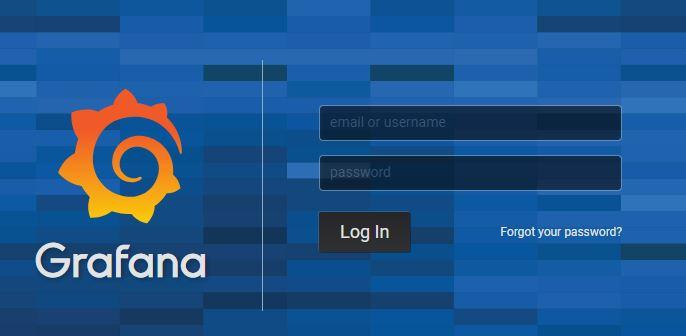

# Tuning, Monitoring and Dashboard
.. index:: tuning
## Tuning
.. index:: number of processes
### Number of processes

A plugin is able to run multiple processes simultaneously.

You may change the number of process allocated for each step of each plugin. In order to configure this number of processes, add or update the `numprocesses` parameter in the [step....] section of the `config.ini` plugin configuration file, e.g.:
```cfg
# Number of process allocate to the step. Default value is 1
numprocesses = 3
```
.. index:: limits, resource
### Resource limits

You are able to control resource limits for each step of a plugin by setting the following parameters in the [step....] section of the `config.ini` plugin configuration file, e.g.:

```cfg
# resource limit for each step process
# rlimit_as => maximum area (in bytes) of address space which may be taken by the process.
# rlimit_nofile => maximum number of open file descriptors for the current process.
# rlimit_stack => maximum size (in bytes) of the call stack for the current process.
#     This only affects the stack of the main thread in a multi-threaded process.
# rlimit_core => maximum size (in bytes) of a core file that the current process can create.
# rlimit_fsize =>  maximum size of a file which the process may create.
# (empty value means no limit)
rlimit_as = 1000000000
rlimit_nofile = 1000
rlimit_nproc = 100
rlimit_stack = 10000000
rlimit_core = 10000000
rlimit_fsize = 100000000
```

For further information about Linux resource limits, check [Linux documentation](http://man7.org/linux/man-pages/man2/setrlimit.2.html).

### Miscellaneous

You are able to act on others tuning parameters for each step of a plugin.

```cfg 
# The number of seconds to wait for a step to terminate gracefully
# before killing it. When stopping a process, we first send it a TERM signal.
# A step may catch this signal to perform clean up operations before exiting.
# If the worker is still active after graceful_timeout seconds, we send it a
# KILL signal. It is not possible to catch a KILL signal so the worker will stop.
# If you use the standard Acquisition framework to implement your step, the
# TERM signal is handled like this: "we don't process files anymore but we
# try to end with the current processed file before stopping". So the
# graceful_timeout must by greater than the maximum processing time of one file.
# Default value is 600 seconds
graceful_timeout = 600

# If set then the step will be restarted sometime after max_age seconds.
# Default value is 310 seconds
max_age = 310

# If max_age is set then the step will live between max_age and
# max_age + random(0, max_age_variance) seconds.
# This avoids restarting all processes for a step at once.
# Default value is 300 seconds
max_age_variance = 300
```

.. index:: monitoring, MFADMIN, dashboard
## Monitoring and Dashboards

.. seealso::
    :doc:`MFADMIN documentation <mfadmin:index>`


### Monitor a plugin
Through Metwork MFADMIN module, you may monitoring your plugin. 

In order to do this, you have to:

- install Metwork MFADMIN and MFSYSMON modules
- in the `[admin]` section of the `config/config.ini` in the root directory of MFDATA, set the `hostname` parameter value with the host name or IP address where MFADMIN is running:
```cfg
[admin]
# null => no monitoring
# hostname=null
# By setting hostname = localhost, we assume MFADMIN is running on the same Linux machine, 
# if MFADMIN is running on a different machine, set hostname = {your_host_name} or { your_host_ip_address}
hostname=localhost
# influxdb_http_port=18086
```

Then restart MFDATA Metwork service:
```bash
service metwork restart mfdata
```

### Dashboards
Dashboards are available from MFADMIN Grafana GUI Interface which is displayed through HTTP on `http://{your_mfadmin_host}:15602`(default login is `admin/admin`), e.g. http://localhost:15602.



Then, click `mfdata` to open MFDATA dashboards.


MFDATA dashboards are displayed. Check MFADMIN documentation for more details.


You may want to implement your own dashboard with specific metrics. In order to do this, you may refer to MFADMIN documentation and the :ref:`mfdata_additional_tutorials:Implement custom monitoring and metrics in a plugin`.

### Useful links and Tips

MFADMIN relies on the following components:

- [Grafana](http://docs.grafana.org/): Data visualization & Monitoring.
- [InfluxDB](https://docs.influxdata.com/influxdb/): Time series database
- [Telegraf](https://docs.influxdata.com/telegraf/): Collecting & reporting metrics

_ _ _

.. tip::
	If you do not see any metrics in your Grafana dashboard, check the `telegraf.log` file in the `log` directory of the root MFDATA directory.

    If you see `[agent] Error writing to output [influxdb]: could not write any address` and/or `net/http: request canceled (Client.Timeout exceeded while awaiting headers)`, you are probably behind a proxy, and this could happen when MFADMIN and MFDATA are not runinng on the same machine.

    You should try to fix this issue by setting the `HTTP_PROXY`, `HTTPS_PROXY` and/or `NO_PROXY` in the `/etc/default/telegraf` file, e.g. `NO_PROXY="*"`
_ _ _

.. tip::
	You may query the InfluxDB database from the InfluxDB’s command line interface `influx` located in `/opt/metwork-mfadmin-master/opt/monitoring/bin/influx`.

    Check **Tools 'InfluxDB command line interface (CLI/shell)'** menu from the `InfluxDB documentation <https://docs.influxdata.com/influxdb/>`_.

    The MFADMIN database name is `metrics`. The default port is `18086`.

Example :
```bash
/opt/metwork-mfadmin-master/opt/monitoring/bin/influx -database 'metrics' -host 'localhost' -port '18086'
```
```sql
Connected to http://localhost:18086 version 1.7.2
InfluxDB shell version: 1.7.2
Enter an InfluxQL query
> select * from grib_to_netcdf_metrics
```

.. important::
	When you upgrade MFADMIN Metwork package, the dashboards are overwritten, so that you may lose the custom dashboards you designed.

    So, it's highly recommended to **export** the dashboards you want to keep, and the **import** the dashboards once the Metwork upgrade is done.

    In order to export/import dashboard, check `Grafana documentation <http://docs.grafana.org/reference/export_import/>`_.

.. important::
	When you upgrade MFADMIN Metwork package, the InfluxDB database that contains metrics is overwritten.

    So, it's recommended to **backup** the InfluxDB database, and the **restore** it once the Metwork upgrade is done.

    In order to backup/restore InfluxDB database, check **Administration 'Backing up and restoring'** menu from the `InfluxDB documentation <https://docs.influxdata.com/influxdb/>`_.

<!--
Intentional comment to prevent m2r from generating bad rst statements when the file ends with a block .. xxx ::
-->
