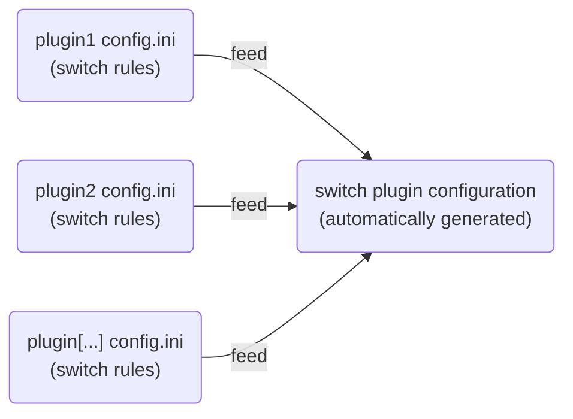
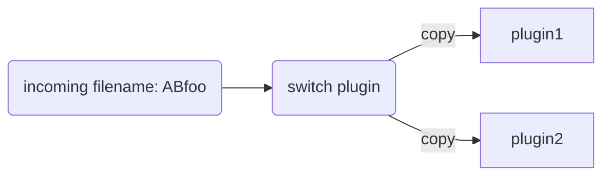
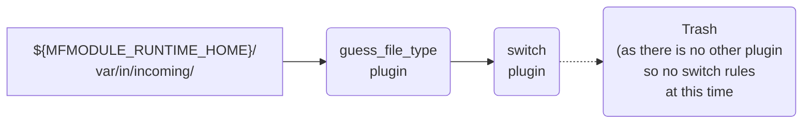
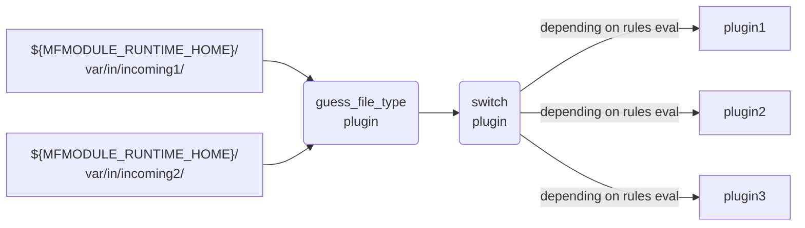
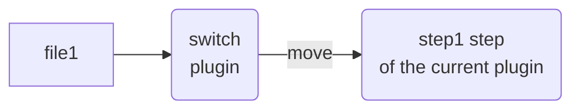
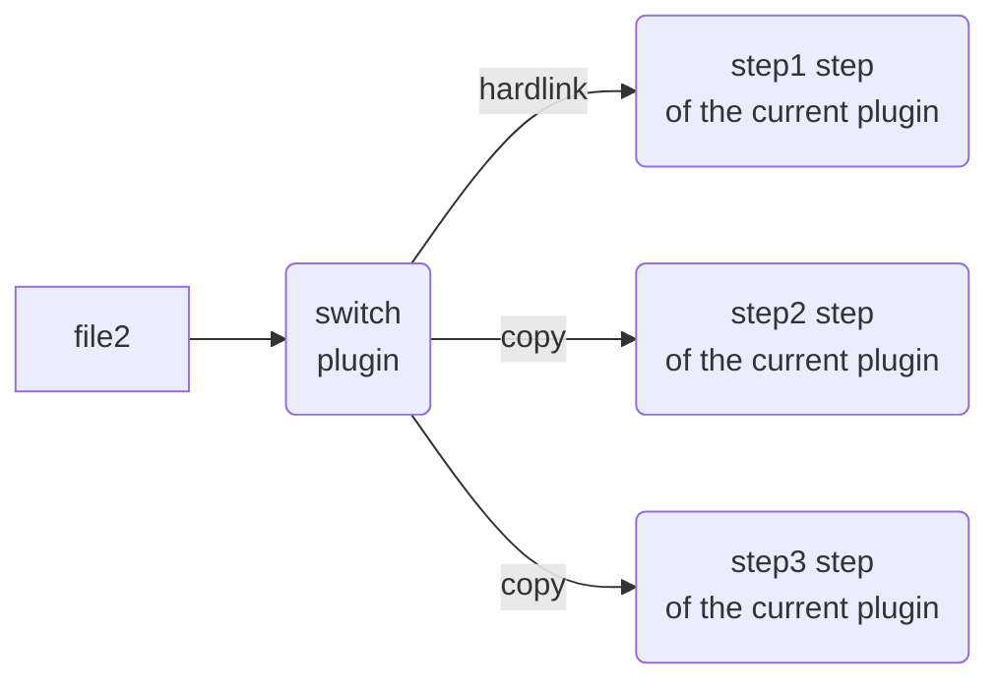

# Switch rules

## Concepts

### The switch plugin

With the `mfdata` module, there is a plugin called `switch` installed by
default.

This default system switch plugin has a special dynamically generated
configuration. This configuration is generated from *switch rules* read
in installed plugins `config.ini` files.

So, there is editable configuration file for this plugin. Its configuration
is generated from other plugins configurations.



The goal of this *switch* plugin is to provide *"loose coupling"* and *"dynamic business routing rules"* between plugins.

It feeds other plugins depending of *rules* evaluated **for each incoming file**.

Let's say for the example that we have 3 *rules*:

- a *rule#1* (from the installed plugin: `plugin1`) which is `True` if the incoming filename starts with `A`
- a *rule#2* (from the installed plugin: `plugin2`) which is `True` if the incoming filename starts with `B`
- a *rule#2* (from the installed plugin: `plugin3`) which is `True` if the incoming filename starts with `AB`

For an incoming filename: `Afoo`, only *rule#1* is `True`, so the `switch` plugin is routing
the incoming file to the plugin: `plugin1`:


For an incoming filename: `Bbar`, only *rule#2* is `True`, so the `switch` plugin is routing
the incoming file to the plugin: `plugin2`:


For an incoming filename: `Cbar`, all *rules* are `False`, so the `switch` plugin is just deleting the incoming file:


For an incoming filename: `ABfoo`, we have two rules evaluated to `True`, so the `switch` plugin is routing the file to both plugins (with a copy):



??? info "With a copy?"
    In this particular case, for performances reasons and to avoid too many copies
    some optimizations are done (hardlinking, copy and moving the last one...) but
    you can consider that each plugin receives a copy of the incoming file
    (at the first order of complexity)

This is "loose coupling" because *switch rules* are described in each plugin (and
not in the `switch` plugin itself).

So if you remove the plugin: `plugin2` in this example (without changing anything else),
a new configuration for the `switch` plugin is automatically generated with the two remaining rules and if you inject another `ABfoo` filename, the routing will automatically change to:


### The guess_file_type plugin

This plugin is also installed by default. In the default configuration, this
plugin listens to some directories and feeds the `switch` system plugin.

As its name suggests, it also try to guess the file type with the [file](https://en.wikipedia.org/wiki/File_(command))/[libmagic](https://linux.die.net/man/3/libmagic) unix tools.

So before giving the file to the `switch` plugin, it will add some interesting "tags" to the file, tags which will be usable in *switch rules* to route (for example) some files of a given type to a specific plugin.

Default configuration after a `mfdata` clean installation:



??? question "${MFMODULE_RUNTIME_HOME}?"
    In most cases, `${MFMODULE_RUNTIME_HOME}=/home/mfdata`

After installing some plugins and configuring another "incoming" directory (see `mfdata` configuration `[internal_plugins]/listened_directories`, you can get something like that:



### Tags

Tags are a kind of context for each file in a `mfdata` workflow in the form a several
key/values. "Good" plugins
keep the context from the beginning of the workflow to the end. So, you can trace
the complete life of a life in the `mfdata` workflow.

Here is a little example:

```
0.guess_file_type.main.ascii_header = mer. juil.  8 12:11:06 CEST 2020
0.guess_file_type.main.enter_step = 2020-07-08T10:11:06:290229
0.guess_file_type.main.size = 33
0.guess_file_type.main.system_magic = ASCII text
1.switch.main.enter_step = 2020-07-08T10:11:06:304117
2.archive.main.enter_step = 2020-07-08T10:11:06:309646
first.core.original_basename = foobar
first.core.original_dirname = incoming
first.core.original_uid = 5479ab3ec3054a499ea81dfda5e7a2bd
latest.core.step_counter = 2
latest.guess_file_type.main.ascii_header = mer. juil.  8 12:11:06 CEST 2020
latest.guess_file_type.main.size = 33
latest.guess_file_type.main.system_magic = ASCII text
```

Tags follow the form: `{step_number_in_the_workflow}.{plugin}.{step}.{tag_name}`.

Notable exceptions are:

- `{plugin}.{step}` replaced by `core` for "always available" tags
- `{step_number_in_the_workflow}` can be replaced or duplicated with:
    - `first` (for `core` tags which values won't change during the workflow)
    - `latest` (for values corresponding to the latest passage in the given step)

Most *switch rules* are a logical expression on values of some of these tags.

Particularly useful tags in *switch rules* are:

- `latest.guess_file_type.system_magic` (available only if the file passed through the `guess_file_type` plugin): the output of the `file` command on the file (for example: `PNG image data, 48 x 47, 8-bit gray+alpha, non-interlaced`)
- `latest.guess_file_type.size` (available only if the file passed through the `guess_file_type` plugin): the file size (in bytes)
- `first.core.original_basename`: the basename of the incoming file (at the very beginning of the workflow)
- `first.core.original_dirname`: the dirname of the incoming file (at the very beginning of the workflow)
- `latest.guess_file_type.ascii_header` (available only if the file passed through the `guess_file_type` plugin): the 60 first ascii characters of the file (ascii codes `<32` or `>126` are filtered)

!!! tip "Important"
    As your own plugins can add some custom tags on the file context, you can also use
    these custom tags on *switch rules* to get workflows like this (for example):

    ```mermaid
    graph LR;
        incoming[".../incoming/"]-->gft("guess_file_type<br/>plugin")
        gft-->switch("switch<br/>plugin")
        switch--"(rule on basename)"-->custom1("custom1<br/>plugin")
        custom1--"(add a custom tag and reinject the file)"-->switch
        switch--"(rule on custom tag)"-->custom2("custom2<br/>plugin")
    ```

## How to set your *switch rules*?

### Introduction

In the `config.ini` file of your plugin, you can add several *rules blocks*:

```
[switch_rules:{rule_type}:{rule_type_param1,rule_type_param2,...}]
```

Each *rules block* defined a rule type and some rule parameters.
Under a "rules block" you can have one or several *switch rules*.

A *switch rule* is a line like:

```
{pattern} = {step_name1}, {step_name2}*, {step_name3}, ...
```

??? question "What about this `*` sign after `step_name2`?"
    If a step name ends with a `*`, it means that the `switch` plugin can use
    hardlinking instead of copying (when there are multiple recipients for the file).

    It's better for performances but target step must not alter the incoming file
    in any way.

    **So please DO NOT ADD THE STAR SIGN IF YOU ARE NOT SURE!**

So, for a given pattern, you can have one or several copy *actions* (separated
by coma). Each *action* means copy (or hardlink) the incoming file to the
given step.

??? question "What about if there is only one recipient step?"
    If there is only one recipient step, the `switch` plugin will use a `move`
    instead of `copy` for performances reasons.

!!! success "Evaluation principles"
    - all *switch rule* are evaluated in the context of their *rule block*. If
    the pattern match (in this context), collected actions are **APPENDED**
    - there is no way to remove a step from the (already collected) recipient list
    - all *switch rules* are systematically evaluated
    - there is no special orders for rules evaluation
    - if a given step appears several times in the final recipient list, duplicates
    are automatically removed (on the technical side, the "recipient list" is a *set* and not a *list*)

### Example

Let's say your add these lines in your plugin `config.ini`:

```ini
[switch_rules:fnmatch:first.core.original_basename]
A* = step1*, step2
B* = step1*

[switch_rules:regex:first.core.original_dirname]
.foo$ = step3
```

We have two *rules blocks*:

- one of `fnmatch` type (with parameter: `first.core.original_basename`)
- one of `regex` type (with parameter: `first.core.original_dirname`)

#### First file

Let's say we have an incoming file with:

- `first.core.original_basename` (original basename of the file) = `Bar`
- `first.core.original_dirname` (original dirname of the file) = `foo`

For the first *rules blocks*, we try the pattern `A*` with `fnmatch` on `first.core.original_basename` value (`Bar`).
It is evaluated to `False.

??? question "fnmatch?"
    `fnmatch` rule type is a basic rule type which use [fnmatch patterns](https://docs.python.org/3.7/library/fnmatch.html)
    (a kind of "Unix shell-style wildcards"). These patterns are basic but very easy to learn and read.

Then we try the pattern `B*` with `fnmatch` on `first.core.original_basename` value (`Bar`). It evaluated to `True`.
So `step1` is added to the list of recipients for this file (hardlinking allowed because of the `*`). But we continue to resolve
other rules.

For the second *rules blocks*, we try the pattern `.foo$` with `regex` on `first.core.original_dirname` value (`foo`).
It is evaluated to `False`.

??? question "regex?"
    `regex` rule type is a rule type which use [re patterns](https://docs.python.org/3.7/library/re.html)
    (regular expressions). These patterns are more powerful but less easy to learn and read than `fnmatch` ones.

So for this first file, we have only one recipient: `step1` and the following routing:



#### Second file

Let's say we have a different incoming file with:

- `first.core.original_basename` (original basename of the file) = `Abar`
- `first.core.original_dirname` (original dirname of the file) = `incoming.foo`

In the first *rule block*, the first line matches so `step1` and `step2` are added to the recipient list.
In the second *rule block*, the rule also matches, so we add `step3` to the recipient list.

So for this second file, we have three recipients: `step1`, `step2`, `step3` and the following routing:



??? info "optimization"
    The previous diagram is not totally accurate as the `switch` plugin will
    probably replace the latest `copy` operation by a `move` operation
    (for performances reasons).


## Available *rule block* types

### `equal`

```ini
[switch_rules:equal:first.core.original_basename]
foo = main
```

It will return `True` only if the given tag value (`first.core.original_basename`
in this example) is equal to `foo` (python `==` operator).

??? question "bytes/utf8?"
    In MetWork < 1.0, tag values were compared as bytes (so strings was often
    prefixed by `b""`). In MetWork >= 1.0, tag values are automatically decoded
    as `utf8` strings. So use standard plain strings here.

### `fnmatch`

```ini
[switch_rules:fnmatch:first.core.original_basename]
A* = step1*, step2
```

`fnmatch` rule type is a basic rule type which use [fnmatch patterns](https://docs.python.org/3.7/library/fnmatch.html) (a kind of "Unix shell-style wildcards"). These patterns are basic but very easy to learn and read.

The example will return `True` if the given tag value (`first.core.original_basename`
in this example) starts with `A`.

### `regex`

```ini
[switch_rules:regex:first.core.original_dirname]
.foo$ = step3
```

`regex` rule type is a rule type which use [re patterns](https://docs.python.org/3.7/library/re.html) (regular expressions). These patterns are more powerful but less easy to learn and read than `fnmatch` ones.

The example will return `True` if the given tag value (`first.core.original_dirname`
in this example) ends with `.foo`.

### `notequal`

```ini
[switch_rules:notequal:first.core.original_basename]
foo = main
```

This is the **inverse rule** than `equal`.

Files which `orginal_basename` are different than `foo` will be routed to the `main` step.

### `notfnmatch`

```ini
[switch_rules:notfnmatch:first.core.original_basename]
A* = step1*, step2
```

This is the **inverse rule** than `fnmatch`.

Files which `orginal_basename` doesn't start with `A` will be routed to the `step1` and `step2` steps.

### `notregex`

```ini
[switch_rules:notregex:first.core.original_dirname]
.foo$ = step3
```

This is the **inverse rule** than `regex`.

This is for completeness only as you can express negative regex in the regex pattern
itself.

### `alwaystrue`

```ini
[switch_rules:alwaystrue]
whatever = main
```

This rule is always `True`. So the `main` step will be in the recipient list
for all files.

### `python`

```ini
[switch_rules:python]
foo.myrule = step1
/special/directory:bar.myrule2 = step2
```

**This is probably the most important rule** as this is the most flexible and
the most powerful.

With the line: `foo.myrule = step1`, you say to call the function `myrule()` in
the file `foo.py` at the root of your plugin directory. If the function returns `True`
for the given file, `step1` will be added to the recipient list.

With the line `/special/directory:bar.myrule2`, you say to call the function `myrule2()`
in the file `bar.py` located in `special/directory/` directory.

The prototype of the function `myrule()` (or `myrule2()`) is very basic. Here is an example:

```python
def myrule(xaf):
    # xaf is the incoming file with its context (XattrFile object)
    # see https://github.com/metwork-framework/xattrfile library
    original_basename = xaf.tags.get('original_basename', None)
    original_dirname = xaf.tags.get('original_dirname', None)
    if original_basename and original_dirname:
        # WARNING: original_basename and original_dirname are bytes
        if original_basename.startswith(b'A'):
            if orginal_dirname.startswith(b'B'):
                return True
    return False
```

!!! warning
    This function should be fast and don't rely on external services as its call
    can block the whole `switch` plugin.
